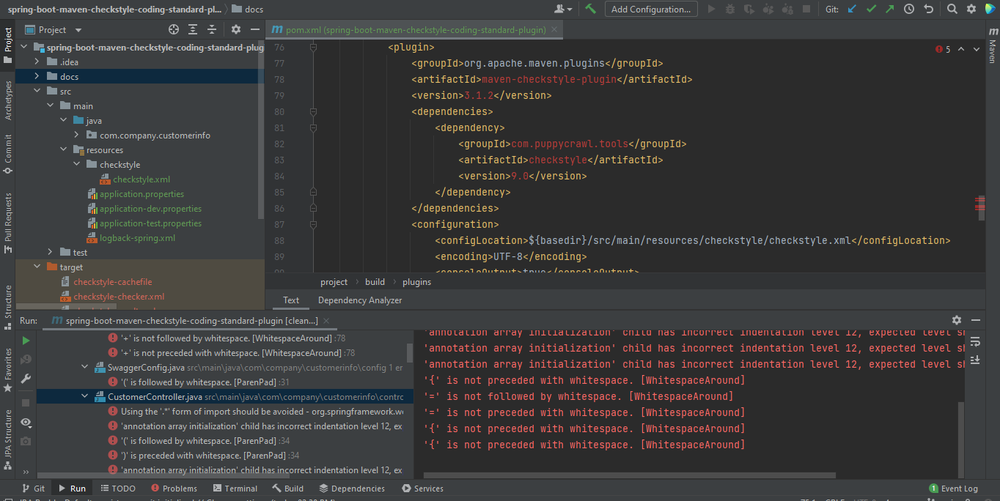

## spring-boot-maven-checkstyle-coding-standard-plugin

Purpose : Enforce common coding style for java source code in IDE at source code compile time.  
Result : Get detailed report about violation of pre-defined common coding style issues such as incorrect indentation, * import, package-class-method-variable naming convention etc.  

### Local run steps  
1- To activate maven checkstyle plugin run the following maven command :  
NOT : Execute maven command from where the pom.xml is located in the project directory.  
<pre> 
$ mvn clean install  
</pre>

[ERROR] \test\StoreServiceIntegrationTest.java:45:19: '(' is followed by whitespace.  
[ERROR] \test\StoreServiceIntegrationTest.java:45:49: ')' is preceded with whitespace.  
[ERROR] \test\java\service\integration\test\StoreServiceIntegrationTest.java:46:19: '(' is followed by whitespace.  
[ERROR] \test\java\service\integration\test\StoreServiceIntegrationTest.java:47:19: '(' is followed by whitespace.  
[ERROR] \test\java\service\unit\test\ProductServiceUnitTest.java:48:32: '(' is followed by whitespace.  
[ERROR] \test\java\service\unit\test\ProductServiceUnitTest.java:48:53: ')' is preceded with whitespace.  
Audit done.  
[INFO] ------------------------------------------------------------------------  
[INFO] BUILD FAILURE  
[INFO] ------------------------------------------------------------------------  
[INFO] Total time:  6.120 s  
[INFO] Finished at: 2021-10-03T15:29:57+03:00  
[INFO] ------------------------------------------------------------------------  
[ERROR] Failed to execute goal org.apache.maven.plugins:maven-checkstyle-plugin:3.1.2:check (validate) on project spring-boot-maven-checkstyle-coding-standard-plugin:  
Failed during checkstyle execution:  
There are 201 errors reported by Checkstyle 9.0  
[ERROR]  

  

### Tech Stack
Java 11  
H2 Database Engine  
spring boot  
spring boot starter data jpa  
spring boot starter web  
spring boot starter test  
hibernate  
logback  
maven  
maven-checkstyle-plugin  
springfox-swagger-ui  
datasource-proxy  
Docker  
 

### Docker build run steps
NOT : Execute docker commands from where the DockerFile is located.  
<pre>
$ docker system prune  
$ docker build . --tag demo   
$ docker run -p 8080:8080 -e "SPRING_PROFILES_ACTIVE=dev" demo:latest  
</pre>

## API OPERATIONS
### Save store with products successfully to database

Method : HTTP.POST  
URL : http://localhost:8080/customer-info/store/save  

Request : 
<pre>
curl --location --request POST 'http://localhost:8080/customer-info/store/save' \
--header 'Content-Type: application/json' \
--data-raw '{
  "name": "jeans_store",
  "products": [
    {
      "name": "prod1"
    },
    {
      "name": "prod2"
    },
    {
      "name": "prod3"
    }
  ]
}'
</pre> 

Response : 

HTTP response code 200  
<pre>
{
    "id": 1,
    "name": "jeans_store",
    "products": [
        {
            "id": 1,
            "name": "prod3"
        },
        {
            "id": 2,
            "name": "prod1"
        },
        {
            "id": 3,
            "name": "prod2"
        }
    ]
}
</pre>

### List Store saved to database

Method : HTTP.GET  
URL : http://localhost:8080/customer-info/store/list  

Request : 
<pre>
curl --location --request GET 'http://localhost:8080/customer-info/store/list'
</pre> 

Response : 

HTTP response code 200  
<pre>
[
    {
        "id": 1,
        "name": "jeans_store",
        "products": [
            {
                "id": 1,
                "name": "prod3"
            },
            {
                "id": 2,
                "name": "prod1"
            },
            {
                "id": 3,
                "name": "prod2"
            }
        ]
    }
]
</pre> 
